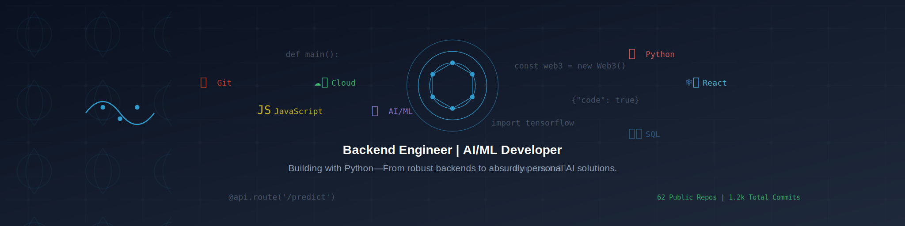

<div align="center">

<h1>Abhay</h1>


[](https://git.io/typing-svg)


</div>


<!-- -->

<!--[https://spotify-github-profile.kittinanx.com/api/view.svg?uid=o70l6egll2fq63dkynopy2kxj&redirect=true][https://spotify-github-profile.kittinanx.com/api/view.svg?uid=o70l6egll2fq63dkynopy2kxj&cover_image=true&theme=natemoo-re&show_offline=true&background_color=121212&interchange=false&bar_color=53b14f&bar_color_cover=false)]-->

[](https://holopin.io/@holygrimm)


🔥 Backend Dev & AI/ML Tinkerer | Solving non-existent problems with over-engineered solutions.<br>
🤖 Training LLMs, wrangling data, and making Python do things it probably shouldn’t.<br>
🔭 I’m currently working on My portfolio, Some AI/ML Projects <br>👯 I’m looking to collaborate on Hacktoberfest Event 2025 (Goal is to build opensource blog platform for no-code/low-code contributions)<br>🤝 I’m looking for help with a opensource blog platform for no-code/low-code contributions<br>
💬 Ask me about Backend Architecture, API microservices, Doing Cool stuff with AI<br>
📫 Reach me at: abhaygp18.dev@gmail.com <br>
‍💻 All of my projects are available in github but here is my temporary [portfolio](https://abhaygpdevportfolio.netlify.app/) <br>
🗃️ My [Resume](https://github.com/darkbits018/darkbits018/blob/main/assets/Copy%20of%20Abhay%20resume%20V2.docx_2.pdf)


### 🔍 Current Experiments:
- Teaching AI to understand my absurd late-night thoughts
- Writing Python that may or may not be sentient
- Building backend systems sturdy enough to survive my questionable life choices

### 👾  Cursed Abilities:
- Debugging at 3 AM with zero memory of the original issue
- Use indentation properly, or I’ll write a script to rm -rf / your existence.
- Turning my personal inconveniences into fully automated solutions (because why fix my habits when I can write code?)

### 🎯 What’s Stuffing My Brain Right Now:
- ⚙️ AI/ML & Deep Learning (Convincing machines to do my thinking for me)
- 🧠 Trying to make AI models behave, but they just gaslight me instead.
- 💾 Vector Databases – Because storing knowledge in traditional databases is too mainstream. 
- 🛡 Hardening auth systems while my own passwords are in a notes app.
- 🐍  If it can’t be done in Python, I don’t want it.
- 🤖 Bills? Tasks? My own brain? If it’s repetitive, I’ll make AI do it.
- 📝 Forgetting to Document – Future me will just reverse-engineer it, right?

## 🤝 Down to Build, Break, and Experiment  

🚀 **AI/ML & LLMs** – Building AI agents, fine-tuning LLMs, and automating the absurd. Got a ridiculous AI idea? I'm in.  

🛠 **Backend & Scalability** – Love designing backend systems, APIs, and microservices. Need help with Flask, FastAPI, or cloud deployments? Let’s talk.  

📊 **Efficient AI & Optimization** – Exploring quantization, LoRA, and AI efficiency hacks. If you’re squeezing more from models, I’m interested.  

🎭 **Chaotic Automation** – If it *shouldn’t* exist but sounds hilarious and borderline useful, count me in.


## 🌐 Socials:
[](https://instagram.com/united.emotions) [](https://linkedin.com/in/abhaygp) [](https://x.com/united_emotion) 

# 💻 Tech Stack:
#### 📜 Languages & Scripting  
    

#### 🌐 Web & Frontend Development  
      

#### 🏗️ Backend & Databases  
      

#### Databases
 

#### 🤖 AI/ML & Data Science  
  

#### 🎨 Design & UI/UX  
   

#### ☁️ Cloud
      

#### 🚀 Deployment
   

#### 🛠 Version Control & Collaboration  
  

#### 💻 Operating Systems & Embedded Systems  
     

#### 🖥 IDEs & Development Tools  
  
   


# 📊 GitHub Stats:

## 🏆 GitHub Trophies


[](https://git.io/streak-stats)


## My Coding Activity 📊


<a href="https://wakatime.com"></a>

<!--START_SECTION:waka-->


**🐱 My GitHub Data** 

> 📦 1.8 MB Used in GitHub's Storage 
 > 
> 🏆 169 Contributions in the Year 2025
 > 
> 💼 Opted to Hire
 > 
> 📜 82 Public Repositories 
 > 
> 🔑 1 Private Repositories 
 > 
**I'm an Early 🐤** 

```text
🌞 Morning                164 commits         ███░░░░░░░░░░░░░░░░░░░░░░   13.02 % 
🌆 Daytime                857 commits         █████████████████░░░░░░░░   68.02 % 
🌃 Evening                166 commits         ███░░░░░░░░░░░░░░░░░░░░░░   13.17 % 
🌙 Night                  73 commits          █░░░░░░░░░░░░░░░░░░░░░░░░   05.79 % 
```
📅 **I'm Most Productive on Thursday** 

```text
Monday                   156 commits         ███░░░░░░░░░░░░░░░░░░░░░░   12.38 % 
Tuesday                  243 commits         █████░░░░░░░░░░░░░░░░░░░░   19.29 % 
Wednesday                162 commits         ███░░░░░░░░░░░░░░░░░░░░░░   12.86 % 
Thursday                 301 commits         ██████░░░░░░░░░░░░░░░░░░░   23.89 % 
Friday                   291 commits         ██████░░░░░░░░░░░░░░░░░░░   23.10 % 
Saturday                 65 commits          █░░░░░░░░░░░░░░░░░░░░░░░░   05.16 % 
Sunday                   42 commits          █░░░░░░░░░░░░░░░░░░░░░░░░   03.33 % 
```


📊 **This Week I Spent My Time On** 

```text
🕑︎ Time Zone: Asia/Kolkata

💬 Programming Languages: 
Markdown                 4 hrs 46 mins       █████████░░░░░░░░░░░░░░░░   35.09 % 
Python                   4 hrs 15 mins       ████████░░░░░░░░░░░░░░░░░   31.26 % 
JavaScript               1 hr 34 mins        ███░░░░░░░░░░░░░░░░░░░░░░   11.54 % 
TypeScript               1 hr 17 mins        ██░░░░░░░░░░░░░░░░░░░░░░░   09.43 % 
CSV                      46 mins             █░░░░░░░░░░░░░░░░░░░░░░░░   05.68 % 

🔥 Editors: 
VS Code                  7 hrs 58 mins       ███████████████░░░░░░░░░░   58.56 % 
PyCharm                  5 hrs 38 mins       ██████████░░░░░░░░░░░░░░░   41.44 % 

🐱‍💻 Projects: 
Python-ML Challenge      4 hrs 9 mins        ████████░░░░░░░░░░░░░░░░░   30.53 % 
EcoStanceAgentV1         2 hrs 37 mins       █████░░░░░░░░░░░░░░░░░░░░   19.26 % 
dashboard_comps_not_visib2 hrs 8 mins        ████░░░░░░░░░░░░░░░░░░░░░   15.71 % 
grocery-app              1 hr 38 mins        ███░░░░░░░░░░░░░░░░░░░░░░   12.06 % 
sc-siem-corvette         1 hr 24 mins        ███░░░░░░░░░░░░░░░░░░░░░░   10.37 % 
```

**I Mostly Code in Python** 

```text
Python                   22 repos            ███████░░░░░░░░░░░░░░░░░░   29.73 % 
JavaScript               14 repos            █████░░░░░░░░░░░░░░░░░░░░   18.92 % 
TypeScript               13 repos            ████░░░░░░░░░░░░░░░░░░░░░   17.57 % 
HTML                     13 repos            ████░░░░░░░░░░░░░░░░░░░░░   17.57 % 
MDX                      1 repo              ░░░░░░░░░░░░░░░░░░░░░░░░░   01.35 % 
```


 Last Updated on 04/12/2025 18:58:59 UTC
<!--END_SECTION:waka-->


### ✍️ Random Dev Quote


---


